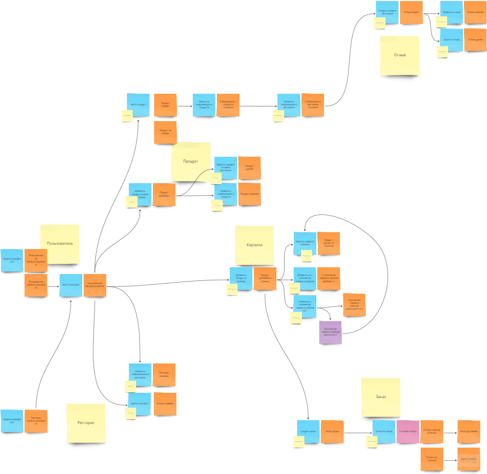

# Food delivery


Our project is a food delivery application that encompasses various functionalities. Users can register as either customers or restaurants and have the capability to edit their accounts. Restaurant accounts have the ability to add or remove items. The website features a catalog displaying all products, as well as a list of restaurants, enabling users to navigate to specific establishments and view their offerings exclusively. The site also provides a search function and allows users to add items to their cart for a seamless ordering experience.

## Application diagram

The application was designed using the Event Storming approach.




## Front-end Stack

- React
- TypeScript
- SCSS
- GraphQL & Apollo
- React-hook-form
- React-hot-toast
- React-icons
- React-select


## About Front-end

The client-side was developed using React with TypeScript, employing component-based design along with modular styles. React-router-dom v6+ was used for routing, and icons were sourced from react-icons. Select components were implemented using react-select, and form validation was achieved through react-hook-form. For server-client communication, GraphQL && Apollo client were utilized to minimize unnecessary data transfer. React seamlessly integrates with .NET, making it a suitable choice for our project.

## Back-end Stack

- Dotnet & C#
- gRPC
- GraphQL
- HotChocolate

## About Back-end

The server-side of the application is built with .NET and utilizes a microservice architecture, with gRPC facilitating communication between the microservices. This setup was chosen for its scalability and efficiency in handling complex, high-load systems.

## How to Install and Run the Project

Clone the repository from the link below

```
git clone https://github.com/Bazl1/Food-Delivery.git
```
Commands to launch the client:
```
cd client

yarn

yarn dev
```

Links to run microservices are provided below

```
// FoodDelivery.ApiGateway
dotnet run

// FoodDelivery.ImageStore
dotnet run

// FoodDelivery.OAuth
dotnet run --urls "https://localhost:7254;http://localhost:5252"

// FoodDelivery.Products
dotnet run --urls "https://localhost:7098;http://localhost:5149"

// FoodDelivery.Orders
dotnet run --urls "https://localhost:7060;http://localhost:5277"
```
