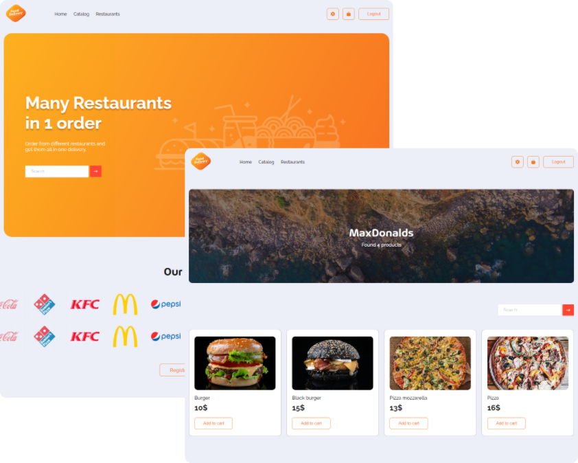

# Food delivery



Our project is a food delivery service application. The server-side of the application is built with .NET and utilizes a microservice architecture, with gRPC facilitating communication between the microservices. This setup was chosen for its scalability and efficiency in handling complex, high-load systems. The client-side was developed using React due to its component-based structure, which allows for a more organized and maintainable codebase. GraphQL was employed for server-client communication to enable clients to request specific data they need, reducing unnecessary data transfer. Despite facing challenges in synchronizing data across different services and handling real-time updates, we managed to create a robust and efficient system.

## Technology Stack

- React
- Dotnet & C#
- gRPC
- GraphQL

## How to Install and Run the Project

Clone the repository from the link below

```
git clone https://github.com/Bazl1/Food-Delivery.git
```

Links to run microservices are provided below

```
// FoodDelivery.ApiGateway
dotnet run

// FoodDelivery.ImageStore
dotnet run

// FoodDelivery.OAuth
dotnet run --urls "https://localhost:7254;http://localhost:5252"

// FoodDelivery.Products
dotnet run --urls "https://localhost:7098;http://localhost:5149"

// FoodDelivery.Orders
dotnet run --urls "https://localhost:7060;http://localhost:5277"
```
